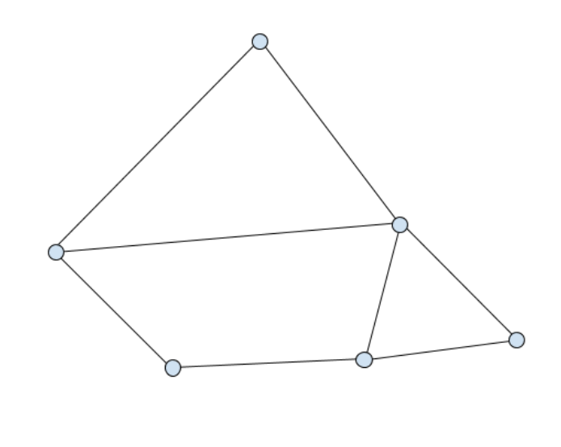

# planar-graph

## Algorithms
- Algorithm 1 -  [find all interior faces of a planar graph](./src/algorithms/algorithm1.ts) 
- Algorithm 2 -  [find face neighbors](./src/algorithms/algorithm2.ts) 
   

#### Getting Started

This repository employs npm, typescript, webpack and wraps those commands with a `Makefile`. 

1. Install dependencies with `make install` . 
2. Transpile and pack the typescript with `make build` .
3. Run unit tests with `make test` .
4. Start the dev server with `make start` (ideally, in a separate shell).
5. View the HTML page with `make view` or at `http://localhost:8080/` once the dev server is running.


#### Initial Assignment

- You’re given vertices connected by edges in the plane. The edges do not intersect except at
  their end points and form a collection of closed polygons. The edges from a connected
  component. Here’s an example with 6 vertices and 8 edges: 
  
  
  
- This data structure is provided in the form of a collection of vertex positions and an edge set.
  Here’s an example. This defines a 2x2 rectangle with a diagonal interior edge:
    ```
    {
       "vertices": [[0, 0], [2, 0], [2, 2], [0, 2]],
       "edges": [[0, 1], [1, 2], [0, 2], [0, 3], [2, 3]]
    }
    ```

#### Basic requirements
1. **Algorithm 1**: Write an algorithm that finds all of the interior faces (polygons) of this data
structure. The output schema should be simple JSON in the format of your choice.
2. **Algorithm 2**: Write an algorithm that processes the output of Algorithm 1 in order to find
the neighboring faces of any face. It should take the output of Algorithm 1 as input,
unique identifier for the face and output an array of face identifiers. The face identifiers
might an integer or string. Include tests (with text descriptions of the input data)
demonstrating that it works.
3. **Write a simple HTML page that presents the output of algorithm 1**. Consider using SVG,
Canvas, or WebGL. The page should display the faces using unique colors. This part of
the challenge is simply to display that you’ve completed the project. If you find that you
have extra time, pursue the Optional requirements, don’t extend the UI.

#### Optional requirements (not undertaken)
1. **Algorithm 3**: Given a point and the output of Algorithm 1, find the face the point is
contained within. Naturally, the point may not be inside of the face. Include tests (with
text descriptions of the input data) demonstrating that it works.
2. **Algorithm 4**: Implement an algorithm that, given a start face, computes the neighboring
faces, and then the neighbors of the neighbor faces and so on. The system should find
“layers” of neighboring face sets. The output should be an array of arrays of face ids until
all faces have been visited. Include tests (with text descriptions of the input data)
demonstrating that it works.